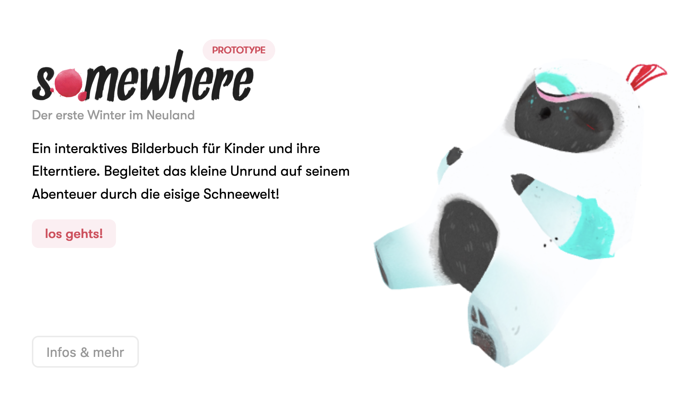
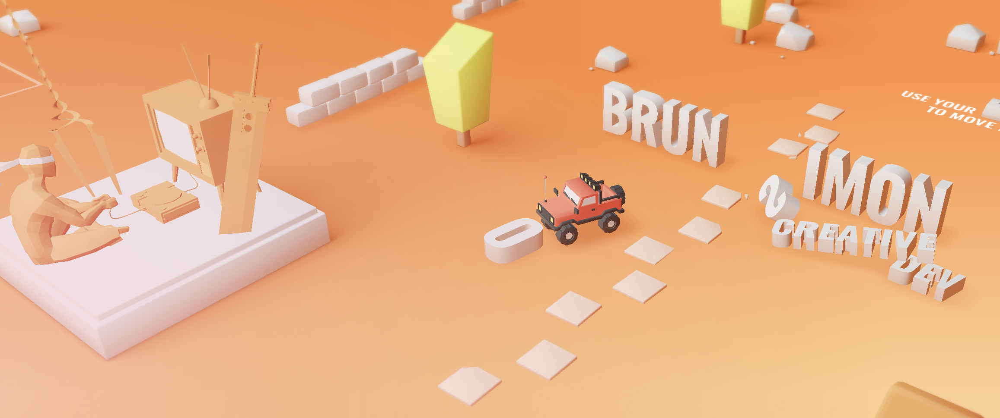
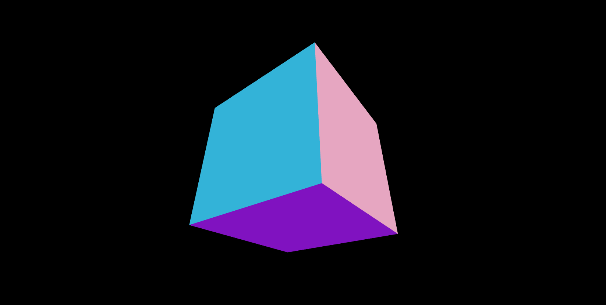
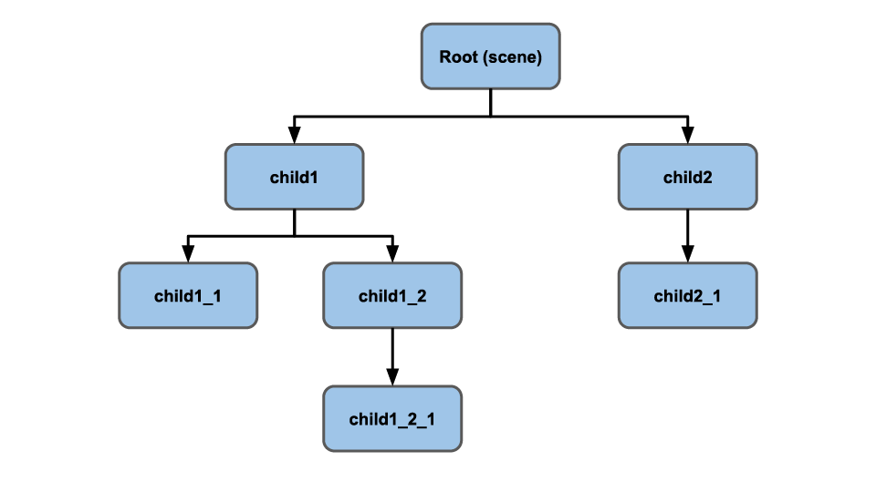
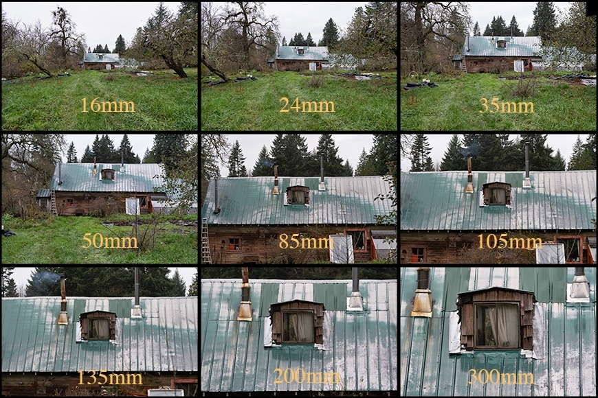
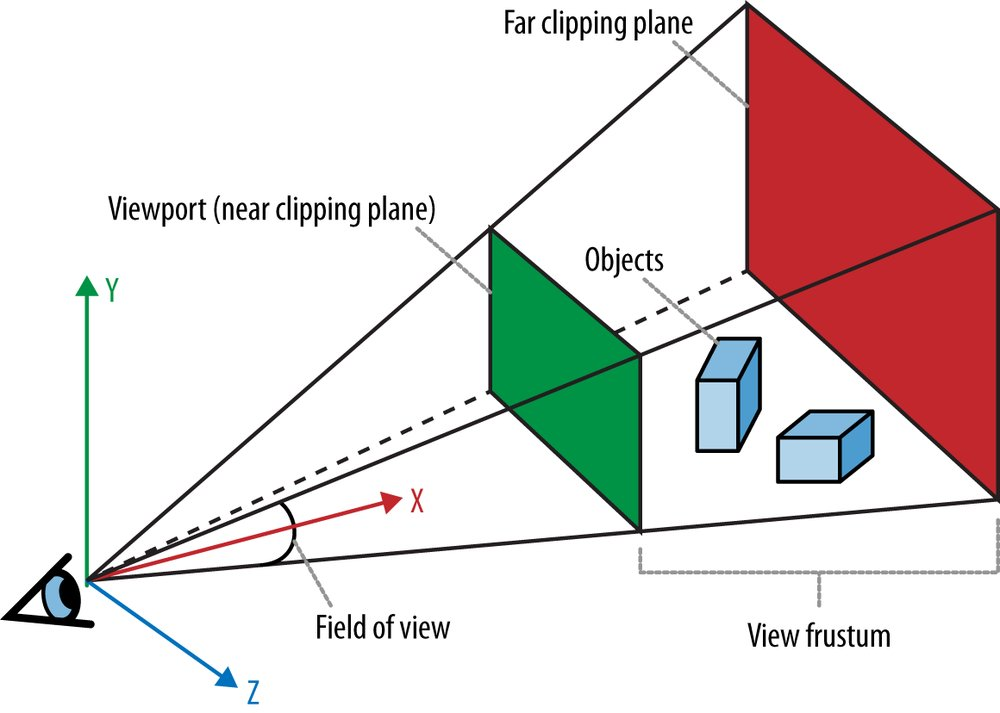
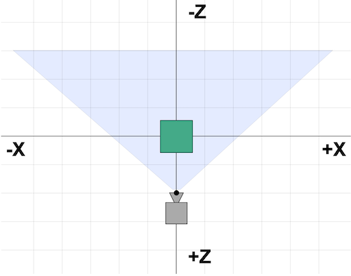
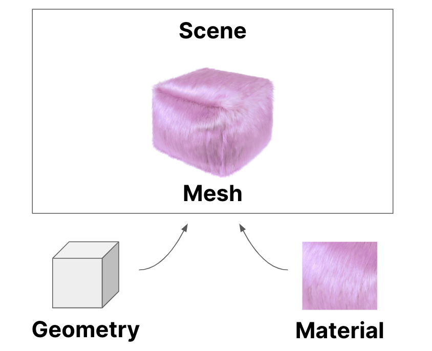
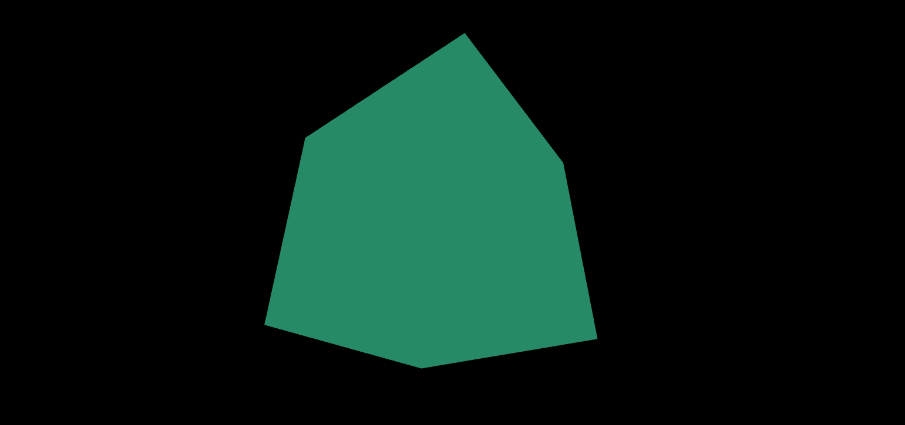
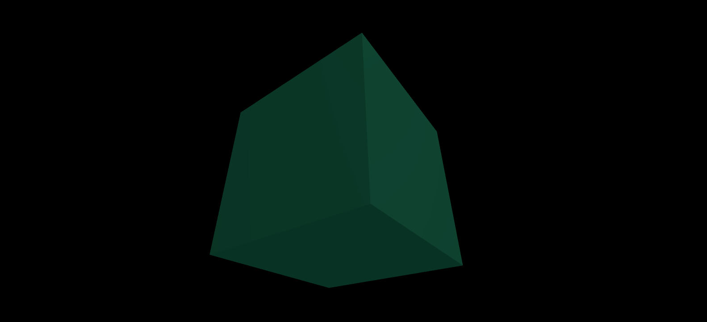

# Creative Coding I: Design & Communication

Prof. Dr. Lena Gieseke \| l.gieseke@filmuniversitaet.de \| Film University Babelsberg KONRAD WOLF

---

# Script 07: Three.js

The first version of this script was written by:
  
Anna Eschenbacher \| anna.eschenbacher@filmuniversitaet.de \| Film University Babelsberg KONRAD WOLF

By now, it has been heavily updated by Lena.

---

* [Creative Coding I: Design \& Communication](#creative-coding-i-design--communication)
* [Script 07: Three.js](#script-07-threejs)
    * [*What are the spatial properties of the virtual spatial we use?*](#what-are-the-spatial-properties-of-the-virtual-spatial-we-use)
    * [*How do analog and virtual spatial spaces relate to each other?*](#how-do-analog-and-virtual-spatial-spaces-relate-to-each-other)
    * [*How does ChatGPT relate to analog space?*](#how-does-chatgpt-relate-to-analog-space)
    * [What is Threejs ?](#what-is-threejs-)
        * [Threejs](#threejs)
        * [WebGL](#webgl)
        * [Alternatives](#alternatives)
    * [Example Projects](#example-projects)
        * [More examples can be found here:](#more-examples-can-be-found-here)
    * [Installation](#installation)
        * [Online Library Files](#online-library-files)
    * [Basic Scene](#basic-scene)
        * [The THREE Object](#the-three-object)
        * [THREE Classes](#three-classes)
        * [JavaScript Objects](#javascript-objects)
        * [Scene](#scene)
        * [Camera](#camera)
        * [Renderer](#renderer)
        * [Coordinate System](#coordinate-system)
        * [Creating 3D Elements](#creating-3d-elements)
        * [Material](#material)
        * [Mesh](#mesh)
        * [Colors](#colors)
        * [Lighting](#lighting)
    * [References](#references)

---

Let's start easy: *what is space*?
  
Check the [Merriam-Webster dictionary for *space*](https://www.merriam-webster.com/dictionary/space). Or ask ChatGPT:  

"Space" can refer to different concepts depending on the context. Here are a few possible interpretations:

* Outer Space: This is the vast, seemingly infinite expanse that exists beyond Earth's atmosphere. It is where stars, planets, galaxies, and other celestial bodies are located. Space is characterized by a near-vacuum environment, microgravity, and extreme conditions.
* Physical Space: In a broader sense, "space" can also refer to the three-dimensional expanse in which all physical objects exist. It is the container in which everything in the universe is located and can be measured in terms of length, width, and height.
* Cosmos: Space is often used synonymously with the term "cosmos," representing the entirety of the universe, including all matter, energy, planets, stars, galaxies, and the voids between them.
* Space as a Concept: In a more abstract sense, "space" can also refer to an interval or gap between objects, or a conceptual framework. For example, the space between two buildings, or the conceptual space in an art piece or a design.


## *What are the spatial properties of the virtual spatial we use?*  

  Dall-E: *Space Virtual*


ChatGPT's answer:

The term "virtual space" typically refers to the digital or simulated environments created for various purposes, such as computer games, virtual reality (VR) experiences, simulations, or digital design. In these contexts, virtual space exhibits several spatial properties:
* **Dimensionality**: Virtual spaces can exist in two, three, or even higher dimensions. Most commonly, virtual environments aim to replicate three-dimensional space to provide a more immersive experience.
* **Scale**: Virtual spaces can simulate various scales, from microscopic to cosmic. For example, a virtual environment might represent the interior of a building, an entire city, or an imaginary world.
* **Interactivity**: Users often have the ability to interact with objects and elements within virtual space. This can include manipulation of virtual objects, navigation through the environment, and engagement with other users (in the case of social virtual spaces).
* **Perspective**: Virtual space can be experienced from different perspectives. In virtual reality, for instance, users can look around in all directions and interact with the environment based on their head and body movements.
* **Physics**: Virtual spaces often simulate some aspects of physics, including gravity, collision detection, and object behavior. This contributes to a more realistic and immersive experience.
* **Navigation**: Users can navigate through virtual space using various means, such as walking, flying, teleporting, or using controllers. The navigation mechanisms depend on the type of virtual environment and the technology used (e.g., VR headsets, computer screens).
* **Immersiveness**: The goal of many virtual spaces is to create a sense of immersion, making users feel like they are present in the simulated environment. This is achieved through realistic graphics, sound, and interactive elements.
* **Connectivity**: Virtual spaces can be connected, allowing users to move seamlessly between different environments. This is common in virtual worlds, games, and collaborative virtual environments.

The spatial properties of virtual space are continually evolving as technology advances, enabling more realistic and immersive digital experiences. Virtual reality, augmented reality, and mixed reality technologies are at the forefront of these developments.


## *How do analog and virtual spatial spaces relate to each other?*  

  Dall-E: *Space Virtual*


ChatGPT's answer:

Analog and virtual spatial spaces are distinct concepts, but they can be related in various ways, especially when considering the representation and interaction with physical and digital environments. Here are some ways in which analog and virtual spatial spaces relate to each other:

* Representation of Physical Space:
    * Analog Space: Refers to the physical space we experience in the real world. It includes the three-dimensional environment around us, encompassing everything from our immediate surroundings to vast landscapes.
    * Virtual Space: A digital representation of space created through computer technology. Virtual spaces can aim to simulate and replicate aspects of analog space, providing a digital counterpart.
* Simulation and Modeling:
    * Analog Space: Represents the actual, tangible world with real physical objects and natural laws governing their behavior.
    * Virtual Space: Involves the creation of a simulated or modeled environment. Virtual spaces often attempt to emulate the properties of analog space, including visual appearance, physics, and interactivity.
* Interaction and Engagement:
    * Analog Space: Involves direct, physical interaction with the environment. Our interactions in the real world are governed by the laws of physics and the properties of tangible objects.
    * Virtual Space: Provides opportunities for interaction through digital interfaces. Users can manipulate virtual objects, navigate through environments, and engage with the digital space using input devices or even through immersive technologies like virtual reality.
* Extension of Reality:
    * Analog Space: The physical world we inhabit and perceive through our senses.
    * Virtual Space: Extends the possibilities of reality by introducing elements that may not exist in the physical world. This could include fantastical landscapes, fictional scenarios, or simulations of environments that are difficult to access in reality.
* Spatial Design and Architecture:
    * Analog Space: The field of physical architecture and spatial design involves creating structures and environments in the real world.
    * Virtual Space: Architects and designers use virtual spaces to visualize and plan structures before they are built. Virtual environments allow for experimentation with designs and concepts.
* Communication and Collaboration:
    * Analog Space: Involves face-to-face communication and collaboration in physical settings.
    * Virtual Space: Facilitates online communication, collaboration, and social interaction. Virtual spaces, including virtual worlds and meeting platforms, allow people to connect in a digital environment.

While analog and virtual spatial spaces have their unique characteristics, the relationship between them is often complementary. Virtual spaces can draw inspiration from, simulate, or enhance aspects of analog space, providing new opportunities for exploration, creativity, and interaction. Additionally, technologies like augmented reality seek to blend analog and virtual elements, creating mixed or augmented spatial experiences.


## *How does ChatGPT relate to analog space?*  

ChatGPT, being a digital language model, primarily exists and operates in the virtual space of computer systems and networks. It doesn't have a direct physical presence in the analog world. However, there are ways in which ChatGPT relates to analog space:

1. **Interaction with Users:**
   - **Analog Space:** In the analog world, humans interact with each other through spoken and written language, body language, and other forms of communication.
   - **ChatGPT:** Acts as a tool for digital communication. Users interact with ChatGPT by inputting text, and the model responds in kind, mimicking a conversation. This interaction occurs in the virtual space of computer interfaces.

2. **Text-Based Communication:**
   - **Analog Space:** Communication through written language, whether it's a letter, a book, or any other written form.
   - **ChatGPT:** Processes and generates text, making it a text-based conversational agent. Users communicate with ChatGPT by providing textual input, and the model responds with textual output.

3. **Information Retrieval and Generation:**
   - **Analog Space:** In the analog world, people seek and provide information through various means, such as books, conversations, or written documents.
   - **ChatGPT:** Serves as a tool for information retrieval and generation in the digital realm. Users can ask questions or request information, and ChatGPT generates responses based on its training data and knowledge.

4. **Online Presence:**
   - **Analog Space:** In the physical world, people have a presence through their actions, interactions, and physical manifestations.
   - **ChatGPT:** Exists in the virtual space of the internet. Its "presence" is in the form of the online service where users can access and interact with the model.

5. **Digital Creativity:**
   - **Analog Space:** Creativity in the analog world is expressed through various forms, including art, literature, and conversation.
   - **ChatGPT:** Can be used to assist or augment creative processes in the digital space. For example, it can generate text for writing, offer ideas, or engage in creative dialogue with users.

It's important to note that while ChatGPT operates in the digital and virtual space, its purpose is to facilitate communication and provide information to users in a way that aligns with natural language understanding. The model itself doesn't have physical existence but can have a meaningful impact on how people interact and communicate in both analog and digital realms.


Analog space, also known as the physical or real world, is unique due to several distinguishing characteristics:

1. **Tangibility:** Analog space consists of tangible, physical entities. Objects in the analog world have mass, occupy space, and can be directly perceived through our senses. This tangible nature distinguishes analog space from the abstract and digital representations found in virtual environments.

2. **Physical Laws:** Analog space is governed by the laws of physics, including gravity, motion, and thermodynamics. Objects in the real world interact with each other based on these fundamental principles, contributing to the predictability and stability of the analog environment.

3. **Sensory Experience:** In analog space, individuals experience the environment through their senses, including sight, sound, touch, taste, and smell. The richness and complexity of sensory experiences contribute to the uniqueness of the analog world.

4. **Spontaneity:** Analog interactions often involve spontaneity and unpredictability. In face-to-face conversations, for example, people respond to each other in real-time, and the flow of communication is dynamic and unscripted. This spontaneity adds a layer of complexity and authenticity to analog interactions.

5. **Social and Cultural Context:** Analog space is deeply embedded in social and cultural contexts. Physical spaces, such as homes, neighborhoods, and cities, carry cultural significance, and human interactions in analog space are shaped by social norms, traditions, and shared experiences.

6. **Limitations and Constraints:** Analog space has inherent limitations and constraints. Physical distances, the constraints of time and resources, and the laws of physics impose boundaries on what is possible in the real world. Overcoming these limitations often requires practical solutions and compromises.

7. **Biological Presence:** Analog space is intimately tied to the presence of living organisms, including humans, animals, and plants. Biological entities contribute to the diversity, complexity, and dynamism of the analog environment.

8. **Ephemeral Nature:** Analog space is characterized by its impermanence and ephemerality. Seasons change, landscapes evolve, and the physical world undergoes constant transformation. This transience contributes to the uniqueness of analog space at different points in time.

9. **Multisensory Integration:** Analog space provides a multisensory experience, where information is processed through a combination of sensory inputs. This integration of sensory information contributes to a holistic understanding of the environment.

10. **Causal Relationships:** Events and interactions in analog space often have clear cause-and-effect relationships. Actions result in tangible consequences, and the interconnectedness of elements in the physical world is a fundamental aspect of analog space.

These characteristics collectively make analog space a rich, dynamic, and diverse environment that serves as the foundation for human existence, interaction, and experience. While virtual and digital spaces offer unique opportunities, analog space remains irreplaceable in its authenticity and complexity.

---

## What is Threejs ?

### Threejs

Three.js is an **open-source library** and **API** using WebGL. It is used to create and display animated 3D graphics in a web browser. It simplifies the creation of WebGL tools and environments. [[2]](https://github.com/mrdoob/three.js/) This means, there is a whole library of simplified functions for geometries, materials, lighting, audio, etc. Alternatively, you could write everything in WebGL, but that is a bit more complicated as you can see in the example below.

### WebGL

WebGL is a JavaScript API for rendering interactive 2D and 3D graphics. It is executed on a computer's GPU. It consists of control code written in JavaScript and shader code which is written in OpenGL ES Shading Language (GLSL ES), a language similar to C or C++. [[1]](https://developer.mozilla.org/en-US/docs/Web/API/WebGL_API)

Here is an example for WebGL code:

```js
<!doctype html>

<html>

  <body>

 	<canvas width="500" height="500"></canvas>

  <script>

    var canvas,
        gl,
        vertices,
        vertexBuffer,
        vertexShader,
        fragmentShader,
        shaderProgram;

    init();
    setupBuffers();
    createVertexShader();
    createFragmentShader();
    createShaderProgram();
    assignShadersToBuffers();
    draw();

    function init()
    {
      canvas = document.getElementsByTagName('canvas')[0];
      gl = canvas.getContext('webgl');
      vertices = [0, 1, 1, -1, -1, -1];
    }

    function setupBuffers()
    {
      vertexBuffer = gl.createBuffer();
      gl.bindBuffer(gl.ARRAY_BUFFER, vertexBuffer);
      gl.bufferData(gl.ARRAY_BUFFER, new Float32Array(vertices), gl.STATIC_DRAW);
      gl.bindBuffer(gl.ARRAY_BUFFER, null);
    }

    function createVertexShader()
    {
      var vertexShaderCode =
      'attribute vec2 coordinates;' +
      'void main(void) {' +
      ' gl_Position = vec4(coordinates, 0, 1.2);' +
      '}';

      vertexShader = gl.createShader(gl.VERTEX_SHADER);
      gl.shaderSource(vertexShader, vertexShaderCode);
      gl.compileShader(vertexShader);
    }

    function createFragmentShader()
    {
      var fragementShaderCode = 'void main(void) {' +
      'gl_FragColor = vec4(1, 0, 0, 1);' +
      '}';

      fragmentShader = gl.createShader(gl.FRAGMENT_SHADER);
      gl.shaderSource(fragmentShader, fragementShaderCode);
      gl.compileShader(fragmentShader);
    }

    function createShaderProgram()
    {
      shaderProgram = gl.createProgram();

      gl.attachShader(shaderProgram, vertexShader);
      gl.attachShader(shaderProgram, fragmentShader);
      gl.linkProgram(shaderProgram);
      gl.useProgram(shaderProgram);
    }

    function assignShadersToBuffers()
    {
      var numberOfComponentsPerVertexAttribute = 2,
          normalizeValues = false,
          numberOfBytesBetweenElements=0,
          offset=0,
          coordinates;

      gl.bindBuffer(gl.ARRAY_BUFFER, vertexBuffer);

      coordinates = gl.getAttribLocation(shaderProgram, "coordinates");

      gl.vertexAttribPointer(coordinates, numberOfComponentsPerVertexAttribute, gl.FLOAT, normalizeValues, numberOfBytesBetweenElements, offset);
      gl.enableVertexAttribArray(coordinates);
    }

    function draw()
    {
      var drawMode = gl.TRIANGLES,
          first=0,
          count=3;

      gl.clearColor(0.7, 0.7, 0.7, 1);
      gl.clear(gl.COLOR_BUFFER_BIT);
      gl.drawArrays(drawMode, first, count);
    }


  </script>

  </body>
</html>
```

This code will produce the following image: <br>

As you can see it it's quite **a lot** of code for a simple red triangle. In WebGL you do all setup steps manually.  

This is where Three.js comes in to simplify the creation of 3D graphics with WebGL.

### Alternatives

There are a few alternatives to Three.js. The most popular one for 3D content might be [babylon.js](https://www.babylonjs.com/). Of course [p5.js](https://p5js.org/) is also an alternative, but mostly used for 2D graphics.

A bablyon.js video promo:

<video height="480" controls="controls">
<source src="../02_scripts/img/space/babylon_01.mp4" type="video/mp4">
</video>

The master thesis project [Somewhere.gl](https://somewhere.gl/index.html) is also created with bablyon.js:

[](https://somewhere.gl/index.html)

## Example Projects

To get a first idea of what Three.js can do, let's have a look at some example projects:

- [bruno](https://bruno-simon.com/) <br>

- [cat](https://codepen.io/Yakudoo/pen/oXJYxy) <br>

- [instancing](https://threejs.org/examples/#webgl_buffergeometry_instancing) <br>

- [underwater journeys](https://www.bluemarinefoundation.com/the-sea-we-breathe/) <br>

- [HELIOS](http://unseen-music.com/yume/)
  <br>

- [POLA](https://www.pola.co.jp/wecaremore/mothersday/)
  <br>

- [Swiss army man](https://swissarmyman.com/)
  <br>

- [NASA voyager's grand tour](https://eyes.nasa.gov/apps/solar-system/#/story/voyager_grand_tour)
  <br>

- [Design the next iPhone](https://neal.fun/design-the-next-iphone/)
  <br>

- [Design the next iPhone](https://fungui.resn.co.nz/)
  <br>

- [VR Dust](https://vrdust.org.uk/)
  <br>

- [Chartongne-Taillet Winery](https://chartogne-taillet.com/en)
 <br>

- [My room in 3d](https://my-room-in-3d.vercel.app/)
 <br>

- [Reactive Sphere](https://organic-sphere.vercel.app/)
 <br>

- [Woodkid Robot](https://experiment-woodkid-volcano-robot.vercel.app/)
 <br>


- [Annas first term project](https://shapedbymotion.herokuapp.com/)  
   <br>

- [noise blob](https://codepen.io/vcomics/pen/ZwNgvX?editors=1010)
- [deprogrammed](http://www.deprogrammed.org/)
- [Thump Thump](http://www.larsberg.net/#/thumpThump)
- [real time short film](http://www.dilladimension.com/)
- [band website](https://www.aquarium.ru/en)
- [prior](https://prior.co.jp/discover/en/emotion)
- [infinit world](https://infinite-world.vercel.app/)

### More examples can be found here:

- [three.js examples](https://threejs.org/examples/#webgl_animation_keyframes)
- [featured projects on the three.js](https://threejs.org/)
- [awarded Three.js projects](https://www.awwwards.com/websites/three-js/?ads=1&page=1)

## Installation

As with all libraries, we can access local or online versions of the library. For a proper local installation there are steps invoved, we don't know yet. We will have a look at that next week.

For getting the coding started, we will simply work with links to online library files.

### Online Library Files

To make an import from three.js online library files, we will use a slightly more sophisticated script call:

```html
    <script type="importmap">
        {
            "imports": {
                "three": "https://unpkg.com/three@0.158.0/build/three.module.js"
            }
        }
    </script>
```

We need the above code due to the way the three.js library is constructed. Roughly speaking, the library is broken into different *modules*, which make it easier to maintain the code-base. The three.js library exports (meaning, *gives to us*) the module `three`. The script type [`importmap`](https://developer.mozilla.org/en-US/docs/Web/HTML/Element/script/type/importmap#import_map_json_representation) allows to specify, which module(s) to import.  The imported library module will replace the text when the module URL is resolved.

Keep in mind, that modules only work with the HTTP(s) protocol. A web-page opened via the file:// protocol cannot use import / export.

Out of the box, three.js includes the fundamentals of a 3D engine. Other three.js components — such as controls, loaders, and post-processing effects — are part of the addons/ directory. [[7]](https://threejs.org/docs/#manual/en/introduction/Installation)

```html
<script type="importmap">
  {
    "imports": {
      "three": "https://unpkg.com/three@0.158.0/build/three.module.js",
      "three/addons/": "https://unpkg.com/three@0.158.0/examples/jsm/"
    }
  }
</script>
```

In total, we have in `index.html` for now:

```html
<!DOCTYPE html>
<html>
  <head>
    <meta charset="UTF-8" />
    <title>Hello three.js!</title>

    <link rel="stylesheet" type="text/css" href="../css/style.css" />

    <script type="importmap">
        {
            "imports": {
                "three": "https://unpkg.com/three@0.158.0/build/three.module.js"
            }
        }
    </script>
  </head>

  <body>
    <canvas id="canvasThree"></canvas>
    <script type="module" src="./scene.js"></script>
  </body>
</html>
```

The three.js scene will be implemented in `scene.js` (often also called `main.js`). Please note, that the script type for a three.js scene must be set to `module`. If you do not specify the type as module, you will get an error, most likely. The type `module` causes the loaded source code to be treated as a JavaScript module, which is needed for three.js to work.

To define the canvas element (here with the id `canvasThree`), in which three.js is going to be rendered is not strictly necessary (similar to p5, where we didn't specify it), but I find it a well-structured setup.

For our first scene, we are going to make our scene fill the whole browser window. Hence, we only need basic css, such as

```css
body {
  margin: 0;
}
```

For such minimal code, we could also just add the code within a script tag within our `.html` file directly:


```html
<!DOCTYPE html>
<html>
  <head>
    <meta charset="UTF-8" />
    <title>Hello three.js!</title>

    <style>
        body { margin: 0; }
    </style>

    <script type="importmap">
        {
            "imports": {
                "three": "https://unpkg.com/three@0.158.0/build/three.module.js"
            }
        }
    </script>
  </head>

  <body>
    <canvas id="canvasThree"></canvas>
    <script type="module" src="./scene.js"></script>
  </body>
</html>
```


To run this project we will use the same extensions as you did before - [live server](https://marketplace.visualstudio.com/items?itemName=ritwickdey.LiveServer) for VSCode. 


## Basic Scene

Now the fun part begins - let's get started with our first three.js scene, which we will implement in th `scene.js` file. 

<!-- A basic three.js project consists of the following elements and we will go through them one by one: <br> [[3]](https://threejs.org/manual/resources/images/threejs-structure.svg) -->

To display something with three.js, such as the beautiful cube below, we need at the very least three components: 

1. a scene, 
2. a camera and 
3. a renderer.

The code below creates a basic scene, displaying a cube. Worry not, in the following script, I will explain each component.

```js
import * as THREE from 'three';

// SCENE
const scene = new THREE.Scene();

// CAMERA
const fov = 70;
const aspect = window.innerWidth / window.innerHeight;
const near = 0.1;
const far = 10;
const camera = new THREE.PerspectiveCamera(fov, aspect, near, far);
camera.position.z = 1;

// RENDERER
const canvas = document.querySelector("#canvasThree");
const renderer = new THREE.WebGLRenderer({canvas, antialias: true});
renderer.setSize( window.innerWidth, window.innerHeight);

// GEOMETRY
const geometry = new THREE.BoxGeometry(0.5, 0.5, 0.5);
const material = new THREE.MeshNormalMaterial();
const cube = new THREE.Mesh( geometry, material );

cube.rotation.x = 100;
cube.rotation.y = 180;
scene.add(cube);

renderer.render(scene, camera);
```




### The THREE Object 

As above for the library loading already mentioned, three.js is a well-structured library, separated into different modules (and classes, see the section below). Such a setup requires us to specify for our JavaScript file, what to import from which module.

The following line indicates to import everything (`*`) from the library's module `three` (the same value as in the `"imports"` call in `index.html`) and save it in an object, which is called `THREE` (in theory, you could change this name, but `THREE` is a convention):

```js
import * as THREE from 'three';
```

In the following code we can now work with the object `THREE` and acess its properties, functions, and classes with the `.`-notation, e.g., `THREE.Scene();`. 

### THREE Classes

In the three.js library many components are encapsulated into classes, e.g., there is a [`Scene`](https://threejs.org/docs/#api/en/scenes/Scene) class, a [`PerspectiveCamera`](https://threejs.org/docs/#api/en/cameras/PerspectiveCamera) class, a [`BoxGeometry`](https://threejs.org/docs/#api/en/geometries/BoxGeometry) and so on.

Don't forget: To access these classes, we always have to use the `THREE` object, which we have imported in the previous step.

The short story for working with three.js is that you have to **create instances from the given classes** in order to work with that component and to, e.g., use that component's functionalities. To create an instance of a class, we have to use the keyword **`new`**. The following code creates an instance of the [`PerspectiveCamera`](https://threejs.org/docs/#api/en/cameras/PerspectiveCamera) class (let's ignore its arguments for now) and we have to access that class through the `THREE` object:

```js
const camera = new THREE.PerspectiveCamera();
```
Once we have created an instance of the [`PerspectiveCamera`](https://threejs.org/docs/#api/en/cameras/PerspectiveCamera) class, we can work with that object:

```js
camera.position.z = 1;
```

The slightly longer explanation is that a class is a common data structure in many programming languages (also see [Script 04 - Javascript - Classes](./cc1_ws2324_04_javascript_script.md#classes)). It let's programmers define their own templates for "a type of object" (conceptually this can be anything) and define which properties and function that object should have. For example, if I am working on a game about cats, I might want to have a data structure for cats, meaning a template for the properties and functions of a cat. Once I have that template -which in computer science lingo is the class- I can derive instances from that template/class, and all instances have certain cat properties and functions.

```js
// The template
class Cat
{
    constructor(name, age) {
        this.name = name;
        this.age = age;
    }
    makeSound() { console.log('meow') }
    getName() { console.log('My name is', this.name) }
}

// The instance
let ernie = new Cat('Ernie', 3);
ernie.makeSound();  // -> meow
```

### JavaScript Objects

When working with three.js, we often have to use objects as data structure (also see [Script 04 - Javascript - Classes](./cc1_ws2324_04_javascript_script.md#objects)). An object let's you group values into a single value, similar to an array but objects use key-value pairs.

You define an object as:

```js
let object_name = {
   key1: value1,
   key2: value2
}
```

```js
let user = {        // an object
  name: "Sully",    // the key "name" stores the value "Sully"
  age: 30           // the key "age" stores the value 30
};
```

The above is usually written more compactly as:

```js
let user = { name: 'Sully', age: 30 };
```

To access a property, we can use:  

`obj.property`  
  
e.g.,

`user.name;`

Which might be confusing, an which might happen, when working with three.js: When defining an object, there is a short-cut for the case that key and value are the same.

Let's say we have a variable `name` that we want to save in a key called `name`:

```js
let name = 'Sully';
let age_sully = 30;

let user = { name: name, age: age_sully };
```

The expresseion `name: name,` within an object can be shortend to just `name`:

```js
let name = 'Sully';
let age_sully = 30;

let user = { name, age: age_sully };
```

For example, when creating an instance of three.js's [WebGLRenderer](https://threejs.org/docs/?q=WebGLRenderer#api/en/renderers/WebGLRenderer) class, it takes as an argument an object. That object has, among other keys, the key `canvas`. The long version of the object as argument would be

```js
const canvas = document.querySelector("#canvasThree");
const renderer = new THREE.WebGLRenderer({canvas: canvas, antialias: true});
```

But as we have the same name for object key and variable to pass, the code is usually written as:

```js
const canvas = document.querySelector("#canvasThree");
const renderer = new THREE.WebGLRenderer({canvas, antialias: true});
```

In the following case, we can not shorten the code, as our variable is called `myCanvas` and not `canvas`:


```js
const myCanvas = document.querySelector("#canvasThree");
const renderer = new THREE.WebGLRenderer({canvas: myCanvas, antialias: true});
```


### Scene

Three.js uses the concept of a *scene*. You can think of a scene as the object, which holds everyhting together, which belongs to a scene, such as geometry and lights, and which is then given to the renderer (together with a camera).

Under the hood, a `Scene` object defines the root of a [scenegrap](https://threejs.org/manual/#en/scenegraph). A scene graph in a 3D engine is a hierarchy of nodes in a tree-like structure, where each node represents a local space:




### Camera

There are a few different camera types in three.js. We will use a [PerspectiveCamera](https://threejs.org/manual/#en/cameras) since its projection mode is designed to mimic the way the human eye sees. 

```js
const fov = 70;
const aspect = window.innerWidth / window.innerHeight;
const near = 0.1;
const far = 10;
const camera = new THREE.PerspectiveCamera(fov, aspect, near, far);
```

As shown above, we can create an instance of the [`PerspectiveCamera`](https://threejs.org/docs/#api/en/cameras/PerspectiveCamera) class with the following arguments:

**PerspectiveCamera( fov : Number, aspect : Number, near : Number, far : Number )**

1. fov — Camera frustum vertical field of view.
2. aspect — Camera frustum aspect ratio.
3. near — Camera frustum near plane.
4. far — Camera frustum far plane.

The first attribute is the **field of view**. FOV is the extent of the scene that is seen on the display at any given moment. The value is in degrees.

For example, this image shows different field of views taken from the same camera position (with real cameras, this is done with changing the focal length of the lens used):

 [[shotkit]](https://shotkit.com/field-of-view/)
  
The second one is the **aspect ratio**. You almost always want to use the width of the element divided by the height, otherwise you'll get a distorted image.  
  
The next two attributes are the **near and far clipping plane**. What that means, is that objects further away from the camera than the value of **far** won't be rendered. Same applies to objects closer than the **near** value. This is mainly used for better perfomance.  

By defining these attributes, we constrain the rendered area to the *view frustum*, which is the space between the green and red planes in this image:



[[5]](https://pbs.twimg.com/media/Di2Z3InU8AAd3bm.jpg)

### Renderer

Next up is the **renderer**. We will use the [WebGLRenderer](https://threejs.org/docs/?q=WebGLRenderer#api/en/renderers/WebGLRenderer). Three.js comes with a few other renderers, often used as fallbacks for users with older browsers or for those who don't have WebGL support for some reason.  

```js
const canvas = document.querySelector("#canvasThree");
const renderer = new THREE.WebGLRenderer({canvas, antialias: true});
```

In the first line we are accessing with plain, old JavaScript the element in the DOM with the id `canvasThree`. This is the canvas element to which we want to render to. This canvas we pass as argument when creating an instance from the [WebGLRenderer](https://threejs.org/docs/?q=WebGLRenderer#api/en/renderers/WebGLRenderer) class.

We also need to **set a size** for the renderer. You can understand this as the "image size", we are rendering to. It is best to use the width and height of the area we want to fill - in this case, the width and height of the browser window.

```js
renderer.setSize( window.innerWidth, window.innerHeight);
```

To actually see a rendering, we have to activate the rendering (probably somewhere at the end of our file, once the scene is put together), with a scene and a camera:

```js
renderer.render(scene, camera);
```

Now we have a **scene**, a **camera**, and **renderer** and with that a fully functioning rendering pipeline. Let's put something into our scene.

### Coordinate System

Before we add any geometry, we have to take a quick look at the coordinate system. We need to clarify the coordingate system of every new environement that we use, as these differ from enviornment to environment. 
As we are now in 3D, next to x, and y we have to consider a thrid dimension, namley z. As default, the camera is looking down the -z axis:

  [[6]](https://threejs.org/manual/resources/scene-down.svg)

Let's start boring and add a cube to the scene.


### Creating 3D Elements

To create a cube (fear not, there are many other shapes available in three.js), we create an instance of the [`BoxGeometry`](https://threejs.org/docs/#api/en/geometries/BoxGeometry) class with its sizes as arguments:

**BoxGeometry(width : Float, height : Float, depth : Float)**

* width — Width; that is, the length of the edges parallel to the X axis. Optional; defaults to 1.
* height — Height; that is, the length of the edges parallel to the Y axis. Optional; defaults to 1.
* depth — Depth; that is, the length of the edges parallel to the Z axis. Optional; defaults to 1.

```js
const geometry = new THREE.BoxGeometry(0.5, 0.5, 0.5);
```

The above code only defines cube geometry. However, to render that cube, we also must create a material to make it visible (the [MeshNormalMaterial](https://threejs.org/docs/?q=MeshNormalMaterial#api/en/materials/MeshNormalMaterial) material is just an example here - it takes the colors from the orientation of the surfaces)


```js
const material = new THREE.MeshNormalMaterial();
```

and add both, geometry and material, to a mesh:

 ```js
const cube = new THREE.Mesh( geometry, material );
```

That is just how three.js wants it. Live with it. Hence, in total we have for creating a geometry, or in three.js lingo a *mesh*:

```js
const geometry = new THREE.BoxGeometry(0.5, 0.5, 0.5);
const material = new THREE.MeshNormalMaterial();
const cube = new THREE.Mesh( geometry, material );
```

### Material

Three.js comes with [several materials](https://threejs.org/manual/#en/materials). All materials can be filled with certain attributes to change the look. This can be color, roughness, as well as a texture. Here, e.g., are all attributes listed for the oldy but goody [MeshPhongMaterial](https://threejs.org/docs/#api/en/materials/MeshPhongMaterial). A Phong material mimicks how real-world surfaces reflect light in a very limited but still useful fashion.

### Mesh

A mesh is an object that takes a **geometry**, and applies a **material** to it. 




Then, we add the mesh to our **scene** with `scene.add()`

```js
scene.add(cube);
```

By default, when we call scene.add(), the object we add will be added to the coordinates (0,0,0). This is why we moved the camera back a bit earlier.


---
Our basic scene is now compeleted. 

Be aware that certain materials only appear, if you have a light in the scene. You can imagine the MeshNormalMaterial material is "self-illuminating", meaning it doesn't need a light to be visible. For the Phong material this is different. Let's change the material to the standard material:


```js
import * as THREE from 'three';


// SCENE
const scene = new THREE.Scene();

// CAMERA
const fov = 70;
const aspect = window.innerWidth / window.innerHeight;
const near = 0.1;
const far = 10;
const camera = new THREE.PerspectiveCamera(fov, aspect, near, far);
camera.position.z = 1;

// RENDERER
const canvas = document.querySelector("#canvasThree");
const renderer = new THREE.WebGLRenderer({ canvas, antialias: true });
renderer.setSize( window.innerWidth, window.innerHeight);

// GEOMETRY
const geometry = new THREE.BoxGeometry( 0.5, 0.5, 0.5 );
const material = new THREE.MeshStandardMaterial({ color: 0x50ffc0 });

const cube = new THREE.Mesh( geometry, material );
cube.rotation.x = 100;
cube.rotation.y = 180;
scene.add(cube);

renderer.render(scene, camera);
```

Notice, how [MeshStandardMaterial](https://threejs.org/docs/#api/en/materials/MeshStandardMaterial) takes as argument an object with the key-value pair color - value.

### Colors

The standard method of specifying color in three.js is with a hexadecimal triplet in the format of `0x...`. There is also the [color class](https://threejs.org/docs/#api/en/math/Color.set) in three.js, which gives you many different options to work with color.

The above scene renders as follows:


That is because the standarf material reacts to light and to make it visible we need to add lights to the scene.


### Lighting

There are a few different [lights](https://threejs.org/examples/?q=light#webgl_lights_hemisphere) like ambient light, directional light, point light, spot light. First, will use an white ambient light to illuminate the whole scene.

```js
// LIGHTING
// AMBIENT
const lightColor = 0xffffff;
const lightIntensity = 0.8;
const ambientLight = new THREE.AmbientLight(lightColor, lightIntensity);
scene.add(ambientLight);
```

Btw. in real life you would code it like this, no need to extra variables if you do not want to re-use those values:

```js
// LIGHTING
// AMBIENT
const ambientLight = new THREE.AmbientLight(0xffffff, 1);
scene.add(ambientLight);
```


Now our scene looks as follows:




Also not too exciting. An ambient light simply makes the whole scene evenly brighter.

Let's also add a point light:

```js
// POINTLIGHT
const pointLight = new THREE.PointLight(0xffffff, 0.5);
pointLight.position.set(2, 2, 2);
scene.add(pointLight);
```

Decrease the intensity of the ambient light to have a resonable sum of the two light intensities (e.g., 0.1 for ambient and 0.8 for the point light).

Now we actually can see the shape in 3D:



Stunning 🤩

Let's also add shadows. For that we add a ground plane first onto which the shadows call fall upon. Also, we will slightly change the camera to have a different framing:


---

## References

[[1] WebGL definition](https://developer.mozilla.org/en-US/docs/Web/API/WebGL_API)  
[[2] Github Three.js](https://github.com/mrdoob/three.js/)  
[[3] Scene Graph](https://miro.medium.com/max/701/1*Bkk14XZa94WTue7F7DrhCA.png)  
[[4] FOV Image](https://cammy-marketing.s3.amazonaws.com/2017/01/1485185693/field-of-view-camera-smartphone-security-camera.png)  
[[5] Clipping Plane](https://pbs.twimg.com/media/Di2Z3InU8AAd3bm.jpg)  
[[6] Coordinate System](https://threejs.org/manual/resources/scene-down.svg)  
[[7] three.js - Installation](https://threejs.org/docs/#manual/en/introduction/Installation)


---

The End

💻 💫 🔺
